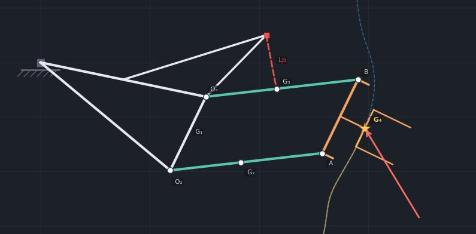

# Physics-Informed Learning vs MLP — Inverse Dynamics of a Rotating Four-Bar Linkage

[](https://www.python.org/downloads/)
[](https://pytorch.org/)
[](LICENSE)


This project compares two approaches to learning the inverse dynamics of a
2-DOF rotating parallelogram four-bar linkage:

- **Physics-informed model** — the Lagrangian structure (M, C, G matrices) is
  hard-coded from the analytical derivation; only 5 scalar physical constants
  are learned from data.
- **MLP baseline** — a standard 3-hidden-layer neural network with no physics
  knowledge, trained on the same data.

---

## Table of Contents

- [Mechanical System](#mechanical-system)
- [Dynamics Derivation](#dynamics-derivation)
- [Method](#method)
- [Key Results](#key-results)
- [Repository Structure](#repository-structure)
- [Installation](#installation)
- [Usage](#usage)
- [Physical Parameter Identification](#physical-parameter-identification)
- [Reference](#reference)
- [Citation](#citation)
- [License](#license)

---

## Mechanical System

A **parallelogram four-bar linkage** mounted on a 1-DOF rotating base.
Two degrees of freedom in minimal coordinates:

- **q₁** — absolute rotation of the base arm
- **q₂** — relative angle of the side links (internal four-bar angle)



**Equations of motion:**
```
M(q₂) q̈  +  C(q₂, q̇) q̇  +  G(q)  =  τ  +  Q_F
```

**Hardware joint limits:** q₁ ∈ [−90°, +30°], q₂ ∈ [−50°, +50°]

**External load:** varying Force applied at end-effector G₄.

---

## Dynamics Derivation

The complete Lagrangian derivation — kinetic energy, potential energy,
Coriolis/centrifugal matrix (via Christoffel symbols), generalised forces
from the prismatic actuator and external load — is documented in:

📄 **[`dynamics/dynamics.pdf`](dynamics/dynamics.pdf)**

This is a self-contained technical report written for this project,
include a moving base, prismatic actuation, and time-varying external loading.
The five composite constants (K₁, K₂, M₁₁,₀, m_eff,1, m_eff,2) derived
in the report are exactly the parameters learned by the physics-informed model.

---

## Method

### Data generation

A **Computed Torque Controller (CTC)** simulates 8 reference trajectories
(sinusoidal paths in Cartesian space, varying amplitude and frequency).
Each simulation uses a time-varying external force F(t) with a 5 ms sensor
delay, producing physically consistent `(q, q̇, q̈, F) → τ` samples.

### Physics-informed model

Directly parameterises the five Lagrangian constants as learnable scalars
and computes torque **analytically**:
```
τ̂ = M̂(q₂) q̈  +  Ĉ(q₂, q̇) q̇  +  Ĝ(q)  −  Q_F
```
The physical structure of M, C, G is fixed from the derivation.
Only the scalar constants are optimised via L-BFGS on torque MSE.

### MLP baseline

3 hidden layers × 128 neurons (35 202 parameters), inputs
`[q, q̇, q̈, F]`, outputs `[τ₁, τ₂]`. No physics knowledge.

---

## Key Results

### Torque prediction RMSE

| Model | Params | Train | Val | OOD | OOD / Train |
|-------|--------|-------|-----|-----|-------------|
| MLP (black-box) | 35 202 | 0.123 N·m | 0.223 N·m | 0.919 N·m | **7.5×** |
| **Physics-informed** | **5** | **0.020 N·m** | **0.016 N·m** | **0.029 N·m** | **1.5×** |

The physics-informed model uses **7 000× fewer parameters** and generalises
better out-of-distribution than the MLP generalises within training.

### Closed-loop controller validation

Validation trajectory in workspace: amplitude = 2.5 cm, 9 waves, T = 36.9 s
(held out — not used in any training or OOD dataset).

| Controller | Tracking RMSE | Max error | Notes |
|-----------|--------------|-----------|-------|
| CTC (ground truth) | **0.094 mm** | 0.691 mm | Known parameters |
| **Physics-informed CTC** | **0.635 mm** | 2.395 mm | Learned parameters |
| MLP | **diverges** (613 mm) | 715 mm | Fails at t = 1.3 s |

The physics-informed model drives a CTC controller using its learned
parameters and remains stable for the full 36.9 s trajectory.
The MLP produces physically inconsistent torques that cause the
closed-loop simulation to diverge immediately.

---

## Repository Structure

```
1R4Bars_PhysicsInformed_Learning/
│
├── dynamics/
│   ├── dynamics.pdf             ← full Lagrangian derivation (self-derived)
│   ├── params.py                ← physical parameters & composite constants
│   └── matrices.py              ← M, C, G matrices; FK, Jacobian, inv/fwd dynamics
│
├── kinematics/
│   └── ik_solver.py             ← analytical initial guess + Newton-Raphson IK
│
├── data/
│   ├── generate.py              ← CTC simulation → .npz dataset files
│   ├── dataset.py               ← PyTorch Dataset wrapper
│   └── saved/
│       ├── train.npz            ← training set    (amp 2.0 cm, 4/5/6/7 waves)
│       └── ood_test.npz         ← OOD test set    (amp 2.5 cm, 4/5/6/7 waves)
│
├── trajectories_ref/            ← reference end-effector trajectories (.csv)
├── figures/                     ← auto-generated output figures
├── models/                      ← saved model checkpoints (.pt, .npz)
├── mechanism.jpg                ← robot structure diagram
│
├── MLP.py                       ← train & evaluate MLP baseline
├── Physics_informed_model.py    ← train & evaluate physics-informed model
├── validating_controllers.py    ← closed-loop CTC / physics-informed / MLP validation
├── generate_trajectories.py     ← reference circular trajectory generation
├── workspace_analysis.py        ← reachable workspace visualisation
├── dataset_physical_verify.py   ← physics consistency check on dataset
├── animate_ctc_latency.py       ← CTC simulation animation with force latency
│
├── requirements.txt
├── README.md
├── CITATION.cff
└── LICENSE
```

---

## Installation

```bash
git clone https://github.com/tuanphuvu/1R4Bars_PhysicsInformed_Learning.git
cd 1R4Bars_PhysicsInformed_Learning

python -m venv pinn_env
source pinn_env/bin/activate

pip install -r requirements.txt
```

CUDA-capable GPU (CPU also works; training takes < 3 s either way).

---

## Usage

```bash
# 1. Visualise the reachable workspace
python workspace_analysis.py

# 2. Generate training and OOD datasets  (skip if using saved/)
python data/generate.py

# 3. Verify dataset physics consistency
python dataset_physical_verify.py

# 4. Train MLP baseline
python MLP.py

# 5. Train physics-informed model
python Physics_informed_model.py

# 6. Closed-loop controller validation (static figure + animation)
python validating_controllers.py
```

---

## Physical Parameter Identification

The physics-informed model recovers the five Lagrangian constants from data:

| Parameter | True | Learned | Error |
|-----------|------|---------|-------|
| K₁ | 0.13700 | 0.02740 | 80% |
| K₂ | 0.11530 | 0.02306 | 80% |
| M₁₁,₀ | 0.48342 | 0.14503 | 70% |
| **m_eff,1** | **0.95000** | **0.94990** | **0.01%** |
| **m_eff,2** | **0.41000** | **0.41000** | **0.00%** |

K₁, K₂, and M₁₁,₀ are not uniquely identifiable from data collected within
the restricted hardware workspace (q₁ ∈ [−90°, +30°], q₂ ∈ [−50°, +50°]).
In this limited motion range, the three constants enter the torque equations
in a near-collinear combination — multiple parameter sets produce the same
torques. The effective masses m_eff,1 and m_eff,2, which dominate the
gravitational term, are fully identifiable and recovered with < 0.01% error.

Despite partial identifiability, the learned parameter set is **functionally
correct inside the operating workspace**: OOD/Train ratio = 1.5×, and
closed-loop tracking error = 0.635 mm over a 36.9 s trajectory.

---

## Reference

> Vu, T. P. (2025-2026). *Lagrangian Dynamic Formulation of a Planar Mechanism
> with a Four-Bar Linkage Mounted on a Rotating Base*.
> [`dynamics/dynamics.pdf`](dynamics/dynamics.pdf)

> Tang, C. P. (2010). *Lagrangian Dynamic Formulation of a Four-Bar Mechanism
> with Minimal Coordinates*. Technical Report (last corrected February 2010).

---

## Citation

```bibtex
@software{vu2026physicsinformed4bar,
  author  = {Vu, Tuan Phu},
  title   = {Physics-Informed Learning vs {MLP} for Inverse Dynamics
             of a Rotating Four-Bar Linkage},
  year    = {2026},
  url     = {https://github.com/tuanphuvu/1R4Bars_PhysicsInformed_Learning},
  license = {MIT}
}
```

---

## License

MIT License — see [LICENSE](LICENSE).
