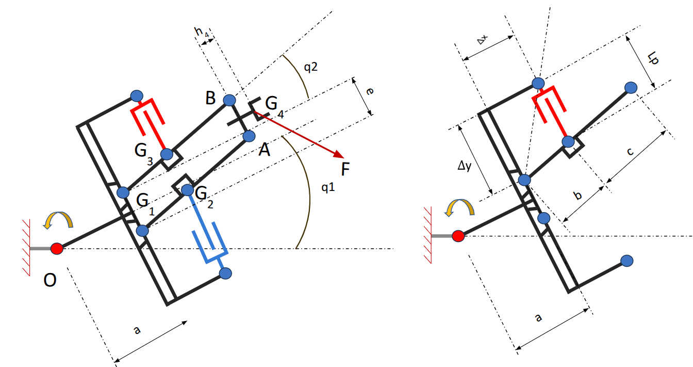
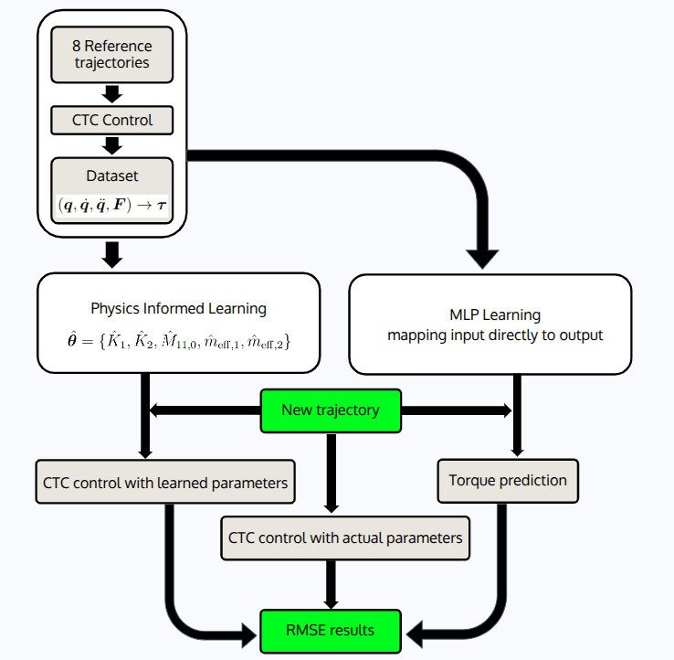
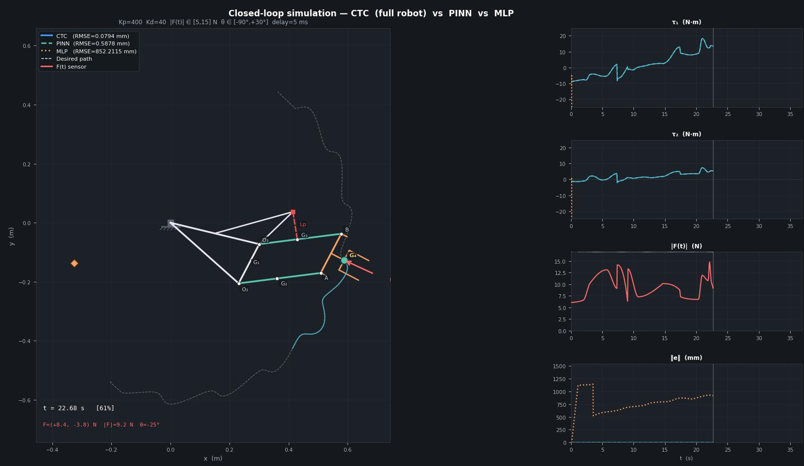

# Physics-Informed Learning vs MLP — Inverse Dynamics of a Rotating Four-Bar Linkage

[](https://www.python.org/downloads/)
[](https://pytorch.org/)
[](LICENSE)

> **Can embedding analytical mechanics into a learning model replace a black-box neural network
> for robot inverse dynamics — using 7 000× fewer parameters?**
>
> Yes. The physics-informed model achieves **46× lower out-of-distribution torque error**
> and **stable closed-loop control** where the MLP diverges within 1.3 seconds.

---

## Overview

This project compares two data-driven approaches to inverse dynamics identification
of a 2-DOF rotating parallelogram four-bar linkage under a time-varying external load:

- **Physics-informed model** — the Lagrangian structure (M, C, G matrices) is
  hard-coded from the analytical derivation; only 5 scalar physical constants
  are learned from data via L-BFGS.
- **MLP baseline** — a standard 3-hidden-layer neural network with no physics
  knowledge, trained on the same data with Adam.



---

## Documentation

Two technical reports accompany this repository:

| Document | Description |
|----------|-------------|
| [`dynamics/dynamics.pdf`](dynamics/dynamics.pdf) | Full Lagrangian derivation — kinematic analysis, kinetic/potential energy, Coriolis matrix via Christoffel symbols, generalised forces from prismatic actuator and external load. |
| [`pdf_Techincal_Reports/Physcal informed learning.pdf`](pdf_Techincal_Reports/Physcal%20informed%20learning.pdf) | Learning methods report — methodology, simulation setup, results tables, parameter identifiability analysis. |

---

## Methodology



Training data is generated by simulating a Computed Torque Controller (CTC)
tracking sinusoidal end-effector trajectories (varying amplitude and frequency).
A time-varying external force F(t) ∈ [5, 15] N with 5 ms sensor latency is applied
at the end-effector, producing physically consistent (q, q̇, q̈, F) → τ samples.

---

## Key Results

### Torque prediction RMSE

| Model | # Params | Train | OOD test | OOD / Train |
|-------|----------|-------|----------|-------------|
| MLP (black-box) | 35 202 | 0.123 N·m | 0.919 N·m | **7.5×** |
| **Physics-informed** | **5** | **0.020 N·m** | **0.029 N·m** | **1.5×** |

### Closed-loop controller validation

Validation trajectory: amplitude = 2.5 cm, 9 waves, T = 36.9 s (held out from all training).

| Controller | Tracking RMSE | Max error | Notes |
|-----------|--------------|-----------|-------|
| CTC (ground truth) | **0.094 mm** | 0.691 mm | Known parameters |
| **Physics-informed CTC** | **0.635 mm** | 2.395 mm | Learned parameters |
| MLP | diverges (613 mm) | 715 mm | Fails at t = 1.3 s |

### Physical parameter identification

| Parameter | True | Learned | Error |
|-----------|------|---------|-------|
| K₁ | 0.13700 | 0.02740 | 80% — not identifiable from limited workspace |
| K₂ | 0.11530 | 0.02306 | 80% — not identifiable from limited workspace |
| M₁₁,₀ | 0.48342 | 0.14503 | 70% — not identifiable from limited workspace |
| **m_eff,1** | **0.95000** | **0.94990** | **0.01%** |
| **m_eff,2** | **0.41000** | **0.41000** | **0.00%** |

K₁, K₂, M₁₁,₀ are structurally unidentifiable from trajectories where q₂
varies only ±7° — multiple parameter combinations produce identical torques
in this regime. The learned set is nonetheless functionally correct for control.



---

## Repository Structure

```
1R4Bars_PhysicsInformed_Learning/
│
├── dynamics/
│   ├── dynamics.pdf             ← Lagrangian derivation (self-derived)
│   ├── params.py                ← Physical parameters & composite constants
│   └── matrices.py              ← M, C, G matrices; FK, Jacobian, inv/fwd dynamics
│
├── kinematics/
│   └── ik_solver.py             ← Analytical initial guess + Newton-Raphson IK
│
├── data/
│   ├── generate.py              ← CTC simulation → .npz dataset files
│   ├── dataset.py               ← PyTorch Dataset wrapper
│   └── saved/
│       ├── train.npz            ← Training set    (amp 2.0 cm, 4/5/6/7 waves)
│       └── ood_test.npz         ← OOD test set    (amp 2.5 cm, 4/5/6/7 waves)
│
├── trajectories_ref/            ← Reference end-effector trajectories (.csv)
├── figures/                     ← Auto-generated output figures
├── models/                      ← Saved model checkpoints
├── pdf_Techincal_Reports/       ← Technical reports (PDF)
│
├── MLP.py                       ← Train & evaluate MLP baseline
├── Physics_informed_model.py    ← Train & evaluate physics-informed model
├── validating_controllers.py    ← Closed-loop CTC / physics-informed / MLP validation
├── generate_trajectories.py     ← Reference trajectory generation
├── workspace_analysis.py        ← Reachable workspace visualisation
├── dataset_physical_verify.py   ← Physics consistency check on dataset
├── animate_ctc_latency.py       ← CTC simulation animation with force latency
│
├── methodology_flowchart.png    ← Methodology diagram
├── mechanism.jpg                ← Robot structure
└── simulation.jpg               ← Simulation screenshot
```

---

## Installation

```bash
git clone https://github.com/tuanphuvu/1R4Bars_PhysicsInformed_Learning.git
cd 1R4Bars_PhysicsInformed_Learning

python -m venv pinn_env
source pinn_env/bin/activate

pip install -r requirements.txt
```

---

## Usage

```bash
# 1. Visualise the reachable workspace
python workspace_analysis.py

# 2. Generate datasets  (skip if using data/saved/)
python data/generate.py

# 3. Verify dataset physics consistency
python dataset_physical_verify.py

# 4. Train MLP baseline
python MLP.py

# 5. Train physics-informed model
python Physics_informed_model.py

# 6. Closed-loop controller validation
python validating_controllers.py
```

---

## Reference

> Vu, T. P. (2025–2026). *Lagrangian Dynamic Formulation of a Planar Mechanism
> with a Four-Bar Linkage Mounted on a Rotating Base*.
> Technical Report

> Tang, C. P. (2010). *Lagrangian Dynamic Formulation of a Four-Bar Mechanism
> with Minimal Coordinates*.

---

## License

MIT License — see [LICENSE](LICENSE).
